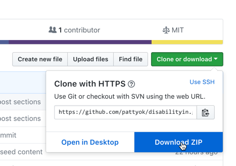

# Disabilty:IN Theme

This is a custom WordPress starter theme for use on Sites within the Disability:IN Network

## Requirements

Your site should be running the latest WordPress version (currently 4.9.8).

Your server should meet or exceed the following requirements:

- PHP version 7.2 or greater.
- MySQL version 5.6 or greater OR MariaDB version 10.0 or greater.
- HTTPS support

This theme is best installed on a clean WordPress Site. If you want to apply it to an existing site, you should do it in a test environment first and make any necessary content updates and then push the changes to your live site.

## Theme installation

### Download the files

1.  Navigate to the [home page of the repository](https://github.com/pattyok/disabilityin).
2.  Click the Green button labeled **Clone or Download**
    
3.  Choose **Download Zip**, and save the zipped file to your computer.

### Install the Theme

1.  Open your WorpPress site and login to the WP Admin Dashboard
2.  Navigate to the themes page. **WP Admin** > **Appearance** > **Themes**
3.  Click **Add New**
4.  Click **Upload**, select the zip file you just downloaded
5.        Once uploaded, you will be redirected to a new page, click **Activate** to activate the new theme.

## Install Plugins

Once your theme is activated you will see a notification about recommended plugins.

TODO INSTALL SCREENSHOT HERE

Click on the link to view recommended plugins.

You can also get to the suggested plugins screen via **WP Admin** > **Appearance** > **Suggested Plugins**

## Site Tour

## Home Page Customization

## Adding Content

## Updating Menus

## Additional Resources
